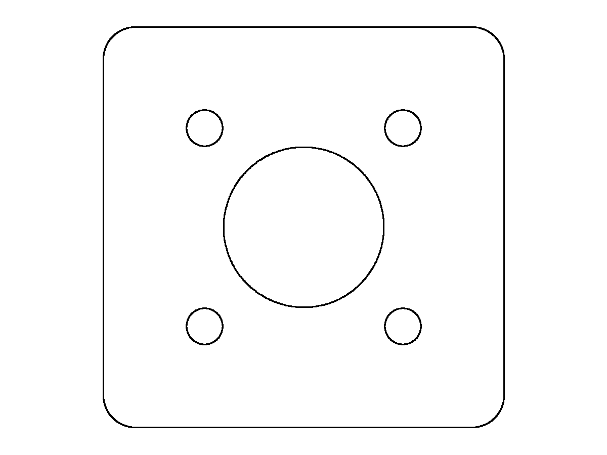
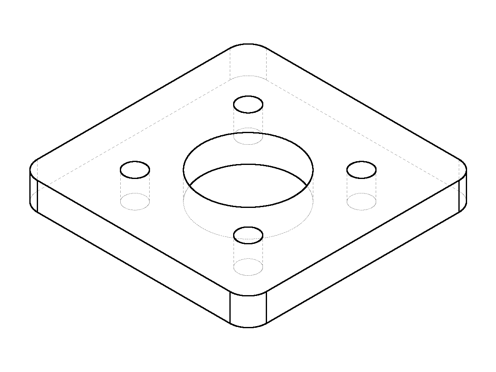

# Verification — night of 2026-09-05, second session

**Rung 2 of the prompt ladder passes, and the part is right this time.** Not
"every call returned ok" — the finished volume and mass match the closed form to
the last digit, the feature list names every feature that was built, and the
picture shows the flange that was asked for.

Getting there took four defects out of the codebase, three of them ours, and
none of them visible from a green test suite.

## What was run

| | |
|---|---|
| Path | the real chat endpoint, `POST /api/v1/ai/chat` — never `dispatch.call_catia`, never a bare `OcctRunner` |
| Model | `qwen3-coder:30b` via Ollama |
| GPU | confirmed resident mid-run: `70%/30% CPU/GPU`, 6572 MiB of 8151 MiB |
| Backend | `GEOMETRY_BACKEND=occt`, `AI_TOOL_LIMIT=40`, `AI_MAX_STEPS=45` |
| Build | `a6595ff`, reported live by `/health` |

The prompt, unchanged from the ladder's rung 2 — several features that must
agree with each other:

> Design a mounting flange. It is a 100 mm square plate, 12 mm thick, aluminium
> 6061-T6. A 40 mm diameter bore through the middle. Four 9 mm clearance holes
> through it on a 70 mm bolt circle, positioned diagonally so one points at each
> corner of the plate. Round the four outside corners with an 8 mm radius. Then
> check the part against every one of those requirements, including its finished
> volume and mass, and list the features you created.

## The result

**18 tool calls, every one `ok`. No refusals, no retries, no invented arguments,
no invented tools.**

```
catia_new_part            {"name": "Mounting Flange"}
catia_sketch_create       {"support": "XY", "name": "Plate Sketch"}
catia_sketch_rectangle    {"width_mm": 100, "height_mm": 100, ...}
catia_pad                 {"length_mm": 12, ...}
catia_sketch_create       {"support": "XY", "name": "Bore Sketch"}
catia_sketch_circle       {"diameter_mm": 40, ...}
catia_pocket              {"through_all": true, ...}
catia_sketch_create       {"support": "XY", "name": "Hole Sketch"}
catia_sketch_circle       {"diameter_mm": 9, "at_radius_mm": 35, "at_angle_deg": 45,  ...}
catia_sketch_circle       {"diameter_mm": 9, "at_radius_mm": 35, "at_angle_deg": 135, ...}
catia_sketch_circle       {"diameter_mm": 9, "at_radius_mm": 35, "at_angle_deg": 225, ...}
catia_sketch_circle       {"diameter_mm": 9, "at_radius_mm": 35, "at_angle_deg": 315, ...}
catia_pocket              {"through_all": true, ...}
catia_fillet              {"radius_mm": 8, "edges": "vertical"}
catia_set_material        {"material": "aluminium-6061-t6"}
check_part                {...}
catia_list_features       {}
check_part                {...}
```

Measured against the closed form, computed independently:

| | closed form | measured |
|---|---|---|
| `volume_mm3` | 101207.47036143667 | 101207.4703614367 |
| `mass_kg` | 0.27326016997587904 | 0.2732601699758791 |
| `face_count` | 15 — two flats, four walls, four corner cylinders, one bore, four holes | 15 |
| `solid_count` | 1 | 1 |
| `features` | `Pad.1, Pocket.1, Pocket.2, Fillet.1` | same |





`flange-front.png` and `flange-section-z.png` are beside them. The section is the
only view that shows a bore is a hole and not a scribed circle.

## The four defects, and how each was found

None of these came out of reading code. All four came from driving the product.

### 1. A bolt circle could not be said at all — a vocabulary gap, not a model failure

Fixed in `9c85f9d`. `catia_sketch_circle` offered exactly one way to state a
position, Cartesian `at`, while the system prompt forbids the model from doing
coordinate arithmetic — on the grounds, which are right, that coordinate
arithmetic belongs inside a tool where it can be tested. "Four holes on a 70 mm
bolt circle, one in each corner direction" is radius 35 at 45°, which is
(24.749, 24.749). **The tool required the one thing the prompt forbade.** The
model did the only other thing available and used the radius as a coordinate,
producing a 99 mm bolt circle that looked entirely plausible and built without
complaint.

Two sessions blamed the model. It was the vocabulary.

`at_radius_mm` / `at_angle_deg` now sit beside `at` on circle, rectangle and
polygon. The trigonometry lives in one file and runs once, on the server: the
parameters are `consumed_by_server`, so `dispatch._augment` resolves them into
`at` before either backend is reached. Two consequences worth stating —
`generated_tools.py` regenerated **byte-identical**, so the workstation daemon
needs no redeploy; and there is one implementation and therefore one angle
convention (anticlockwise from the sketch's horizontal axis, which is what
`catia_sketch_arc` already uses).

The prompt gained one general rule and no recipe: a position given as an offset
is `at`, a position given as a distance and a direction is polar, and turning the
second into the first yourself *is* the coordinate maths.

### 2. A material set after the build never produced a mass

Fixed in `55557da`. `PartDocument.measure` cached the whole payload against the
shape and invalidated it on geometry changes. `catia_set_material` changes the
density and no geometry, so it invalidated nothing — a material set after the
first measurement never reached a mass for the rest of the session, while the
payload went on naming the material beside `mass_is_provisional` and no
`mass_kg`.

Measured: the agent set aluminium, got `ok` and 2700 kg/m³ back, measured, was
handed no mass, and **invented one — 273 kg for a part weighing 0.27.**
Fabricating it was the model's fault. Being unable to read one was ours, and it
is exactly the unmeasured claim Decision 3 exists to prevent.

The cache now holds density-free geometry and the mass is computed onto it per
call. The invariant, which the module's own docstring already stated one
paragraph above the line that broke it: **what is cached must be a function of
the shape alone.**

### 3. `solid_count == 1` was refused for want of a tolerance

Fixed in `55557da`. `Assertion` refuses `==` with no slack because a kernel does
not return round decimals. True of a length; false of a count. Asked to check the
part it had built, the model claimed `solid_count == 1` — correct, and exactly
checkable — and was refused three times and told to add slack to it. Half a face
is not a thing.

`counts_things()` decides from the path, because `app/design/` must not import
`app.kernel.contract` (that pulls ~166 MB of OCP into a package whose tests run
offline in under a second). A test reads the real contract, where `unit="count"`
lives, and asserts the two agree on every declared path — so the convention is
checked against the source of truth without the import edge.

### 4. The second unnamed pocket rewrote the first one's labels

Fixed in `a6595ff`, and the one that would have been hardest to find later. The
flange reported `[Pad.1, Pocket.1, Fillet.1]` — three features for four
operations.

Every operation defaulted an unnamed feature to its own tool's word, and
`add_feature` treats a name it has seen as **a regeneration of that feature**,
which is required when a compiled plan is rebuilt. So the second pocket rewrote
the first one's labels rather than becoming a feature of its own.

**The geometry stayed right the whole time, which is exactly why it survived four
verification runs.** A cut lands on the part's shape whether or not the
bookkeeping is sane. What was wrong was the names — and names are what a scoped
fillet, a seeded pattern and every `feature#selector` resolve against. An agent
almost never passes a name, so this was the ordinary path, not an edge case.

## Checks

- `ruff check app/ tests/` — clean
- `mypy app/` — clean, 229 files
- Offline suites — 1,264 passed
- New tests: 43 placement, 11 mass, 29 count, 10 feature-naming
- Every new guard verified by breaking the thing it guards; the failures are
  named in each commit message

## What was not verified, and why

**The CATIA seat.** CATIA V5 is open on this machine but the bridge daemon is
not running, and starting it needs a device token issued to an account. Binding
the seat to the overnight test account is the thing that has caused trouble
before, and doing it unattended at 21:40 with the user asleep is not a trade
worth making — so this session's end-to-end is the open kernel only.

What can honestly be said about the seat without running it: polar placement is
resolved on the server and the daemon's own schema regenerated byte-identical, so
the wire contract is provably unchanged. The naming and mass fixes are both in
`app/kernel/occt/`, which the seat does not execute. That is an argument, not a
measurement, and it is recorded as one.

**Where the ladder stopped.** Rung 2, passed cleanly. Rung 3 — a part the agent
must *measure and correct*, "make it 2.4 kg" — is the next one, and is now
unblocked: it needs a readable mass, which is defect 2, fixed tonight.
